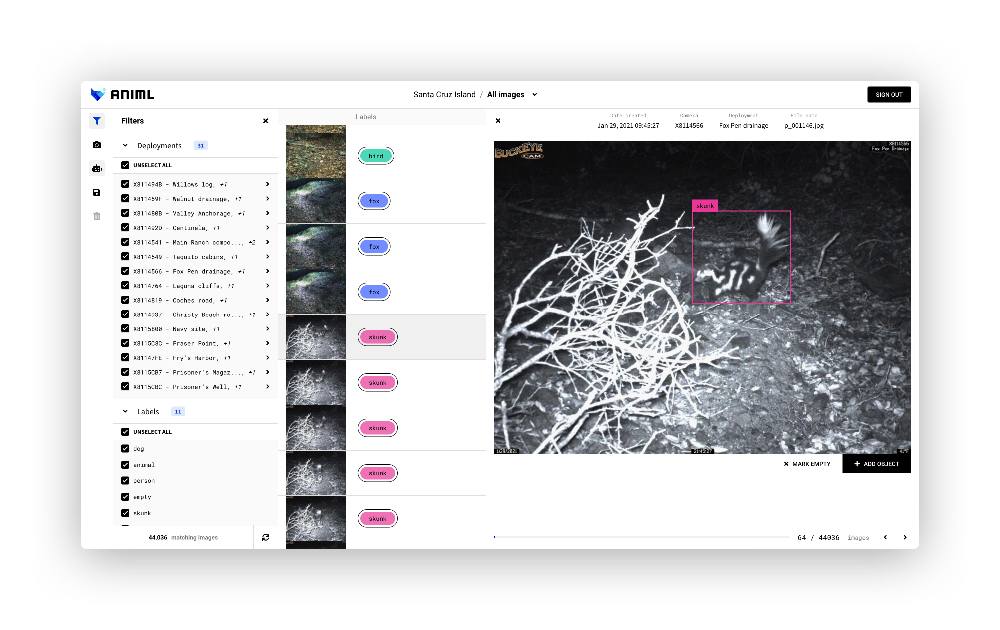

# Animl Frontend

A frontend web app for viewing & labeling camera trap data by
[The Nature Conservancy](https://www.nature.org/).

## Overview

Animl is an open, extensible, cloud-based platform for managing camera trap data.
We are developing this platform because there currently are no software tools that allow
organizations using camera traps to:

- ingest data from a variety of camera trap types (wireless, SD card based, IP, etc.)
- systematically store and manage images in a single centralized, cloud-based repository
- upload custom object detection and species clasification ML models and configure
  automated assisted-labeling pipelines
- Offer frontend web application to view images, review ML-assisted labels,
  perform manual labeling
- Offer an API for advanced querying and analysis of camera trap data
- Offer tools for exporting ML model training data

This repository contains the frontend web application for viewing and
interacting with the camera trap data. It is a React app, using [Redux](https://redux.js.org/) (specifically [Redux Toolkit](https://redux-toolkit.js.org/)) for state management and [Vite](https://vitejs.dev/) for tooling.

## Available Scripts

In the project directory, you can run:

### `npm start`

Runs the app in the development mode. 
Open [http://localhost:5173](http://localhost:5173) to view it in the browser.

The page will reload if you make edits. 
You will also see any lint errors in the console.

### `npm run build`

Builds the app for production to the `build` folder. 
It correctly bundles React in production mode and optimizes the build for the best performance.

The build is minified and the filenames include the hashes. 
Your app is ready to be deployed!

### `npm run build:staging`

Builds the app for deployment to the staging environment. 
It will request backend resources that are also in their respective staging environments.

### `npm run deploy-dev` & `npm run deploy-prod`

Builds the app for deployment and deploys it to dev/production environment. 

## Prod deployment

Use caution when deploying to production, as the application involves multiple stacks (animl-ingest, animl-api, animl-frontend), and often the deployments need to be synchronized. For major deployments to prod in which there are breaking changes that affect the other components of the stack, follow these steps:

1. Set the frontend `IN_MAINTENANCE_MODE` to `true` (in `animl-frontend/src/config.js`), deploy to prod, then invalidate its cloudfront cache. This will temporarily prevent users from interacting with the frontend (editing labels, bulk uploading images, etc.) while the rest of the updates are being deployed.

2. Manually check batch logs and the DB to make sure there aren't any fresh uploads that are in progress but haven't yet been fully unzipped. In the DB, those batches would have a `created`: <date_time> property but wouldn't yet have `uploadComplete` or `processingStart` or `ingestionComplete` fields. See this issue more info: https://github.com/tnc-ca-geo/animl-api/issues/186

3. Set ingest-image's `IN_MAINTENANCE_MODE` to `true` (in `animl-ingest/ingest-image/task.js`) and deploy to prod. While in maintenance mode, any images from wireless cameras that happen to get sent to the ingestion bucket will be routed instead to the `animl-images-parkinglot-prod` bucket so that Animl isn't trying to process new images while the updates are being deployed.
4. Wait for messages in ALL SQS queues to wind down to zero (i.e., if there's currently a bulk upload job being processed, wait for it to finish).

5. Backup prod DB by running `npm run export-db-prod` from the `animl-api` project root.

6. Deploy animl-api to prod.

7. Turn off `IN_MAINTENANCE_MODE` in animl-frontend and animl-ingest, and deploy both to prod, and clear cloudfront cache.

8. Copy any images that happened to land in `animl-images-parkinglot-prod` while the stacks were being deployed to `animl-images-ingestion-prod`, and then delete them from the parking lot bucket.

## Related repos

Animl is comprised of a number of microservices, most of which are managed in their own repositories.

### Core services

Services necessary to run Animl:

- [Animl Ingest](http://github.com/tnc-ca-geo/animl-ingest)
- [Animl API](http://github.com/tnc-ca-geo/animl-api)
- [Animl Frontend](http://github.com/tnc-ca-geo/animl-frontend)
- [EXIF API](https://github.com/tnc-ca-geo/exif-api)

### Wireless camera services

Services related to ingesting and processing wireless camera trap data:

- [Animl Base](http://github.com/tnc-ca-geo/animl-base)
- [Animl Email Relay](https://github.com/tnc-ca-geo/animl-email-relay)
- [Animl Ingest API](https://github.com/tnc-ca-geo/animl-ingest-api)

### Misc. services

- [Animl ML](http://github.com/tnc-ca-geo/animl-ml)
- [Animl Analytics](http://github.com/tnc-ca-geo/animl-analytics)
